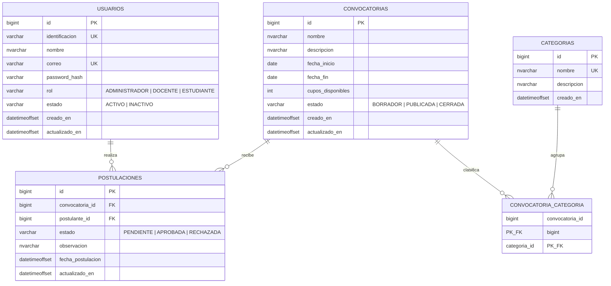

# Sistema de Gestión de Convocatorias Institucionales — USCO

API REST para administrar convocatorias institucionales (becas, monitorías, proyectos…), sus categorías, los usuarios del sistema y las postulaciones, con autenticación JWT y control de acceso por roles.

> **Stack:** Java 21 · Spring Boot 3.3 · Spring Security + JWT (access + refresh) · SQL Server 2022 · Flyway · Lombok · Docker Compose.

> **Autenticación:** access token de corta duración (15 min) + refresh token (7 días) para renovarlo sin volver a iniciar sesión. Configurable por `JWT_ACCESS_EXPIRATION_MS` / `JWT_REFRESH_EXPIRATION_MS`.

## Estructura

```
.
├── backend/          # API REST (Spring Boot, monolito modular com.usco)
├── db/scripts/       # Script SQL completo
├── postman/          # Colección Postman
└── docker-compose.yml
```

## Requisitos
- Docker y Docker Compose. No se necesita Java/Maven local: el backend se compila dentro de Docker.

## Cómo levantar

```bash
docker compose up -d --build
```

Levanta tres servicios:
1. **db** — SQL Server 2022.
2. **db-init** — crea la base de datos `convocatorias_db` (contenedor de un solo uso).
3. **backend** — API en `http://localhost:8080` (aplica migraciones Flyway y crea el admin semilla al arrancar).

Variables configurables vía `.env` (ver `.env.example`): `DB_PASSWORD`, `JWT_SECRET`, `CORS_ALLOWED_ORIGINS`.

### Credenciales semilla
| Rol | Correo | Contraseña |
|-----|--------|------------|
| ADMINISTRADOR | `admin@usco.edu.co` | `Admin123*` |

## Probar la API
El detalle de endpoints (rutas, cuerpos y respuestas) vive en Swagger y en la colección de Postman; no se duplica aquí.
- **Swagger UI:** `http://localhost:8080/swagger-ui.html`
- **Postman:** importar `postman/Convocatorias-USCO.postman_collection.json` y ejecutar primero `Auth > Login` (guarda el token automáticamente; el resto de peticiones lo heredan).

## Roles y permisos
| | ADMIN | DOCENTE | ESTUDIANTE |
|---|:--:|:--:|:--:|
| Gestionar usuarios | ✅ | ❌ | ❌ |
| Crear/editar convocatorias y categorías | ✅ | ❌ | ❌ |
| Ver convocatorias / categorías | ✅ | ✅ | ✅ |
| Postularse / ver postulaciones propias | ❌ | ✅ | ✅ |
| Aprobar/rechazar y ver todas las postulaciones | ✅ | ❌ | ❌ |
| Reportes | ✅ | ❌ | ❌ |

## Modelo de datos (DER)



> `convocatoria_categoria` es la tabla puente de la relación **N:M** entre convocatorias y categorías (PK compuesta de ambas FKs). `postulaciones.postulante_id` referencia a `usuarios` (estudiante o docente).

## Base de datos
- Script SQL completo: `db/scripts/00_full_script.sql`.
- En la app, el esquema se aplica con **Flyway** (`backend/src/main/resources/db/migration`).
- Acceso directo (DBeaver etc...): host `localhost`, puerto `1433`, usuario `sa`, contraseña `Surcolombiana2026*`, base `convocatorias_db`.

## Desarrollo del backend sin JDK local
Compilar / ejecutar tests con Maven dentro de Docker:
```bash
docker run --rm -v "$PWD/backend":/app -v "$HOME/.m2":/root/.m2 \
  -w /app maven:3.9-eclipse-temurin-21 mvn test
```

## Comandos útiles
```bash
docker compose logs -f backend     # ver logs
docker compose stop                # detener
docker compose down -v             # detener y borrar datos (reset total)
```
